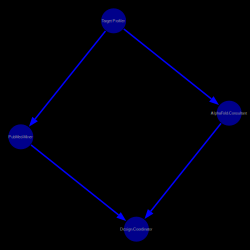

# PlanGraphs

A lightweight Julia framework for modeling and executing complex, multi-agent workflows. PlanGraphs allows you to define tasks (steps) that can run in series or parallel using a Directed Acyclic Graph (DAG) powered by MetaGraphsNext.jl.

Core Concepts
StepConfig: The metadata for a single task. It includes the task's logic (a run function), iteration limits, and descriptive metadata.

PlanGraph: The container for the workflow. It manages the relationships (dependencies) between steps.

Dependencies: Defined using the afterNodes argument. If Step B lists Step A in afterNodes, Step B is in "series" with A. If Step B and Step C both list Step A, then B and C are effectively "parallel."

Data Structures
StepConfig
Defines the individual unit of work.

Julia
@kwdef mutable struct StepConfig
    name::String      # Unique identifier for the step
    about::String     # Description of what the step does
    run::Function     # The executable logic (e.g., x -> println(x))
    maxIter::Int      # Maximum allowed iterations for this step
    level::Int        # Hierarchical level (useful for visualization)
end
PlanGraph
Wraps the MetaGraph to provide a high-level interface.

Julia
mutable struct PlanGraph
    mg::MetaGraph{String, StepConfig, Nothing, Dict, Nothing}
    name::String
    about::String
end
API Reference
addStep!(pg, step; afterNodes=nothing)
Adds a StepConfig to the graph.

step: The StepConfig instance to add.

afterNodes: A Vector{StepConfig} representing the dependencies. The function will assert that these dependencies already exist in the graph.

Example Usage: Bioinformatics Research Workflow
This example demonstrates an agentic workflow where multiple specialized agents (Target Profiling, AlphaFold, PubMed Mining) work in parallel to design a protein binder.

```julia
using PlanGraphs# (Or include your script)


# 1. Initialize the Plan
bio_plan = PlanGraph("Binder-Discovery", "Multi-agent protein design")

# 2. Define the Root Agent

target_analyst = StepConfig(
    name="Target Profiler", 
    about="Extracting binding pockets", 
    run=x -> println("Executing: Target Profiler"),
    maxIter=1, level=1
)
addStep!(bio_plan, target_analyst)

# 3. Define Parallel Analysis Agents
struct_agent = StepConfig(
    name="AlphaFold-Consultant", 
    about="Structural flexibility", 
    run=x -> println("Executing: AlphaFold-Consultant"),
    maxIter=3, level=2
)

lit_agent = StepConfig(
    name="PubMed-Miner", 
    about="Literature mining", 
    run=x -> println("Executing: PubMed-Miner"),
    maxIter=5, level=2
)

# Add them to the graph, specifying they follow the 'target_analyst'
addStep!(bio_plan, struct_agent, afterNodes=[target_analyst])
addStep!(bio_plan, lit_agent,    afterNodes=[target_analyst])

# 4. Define a Consolidation Step (Convergence)
design_coord = StepConfig(
    name="Design-Coordinator", 
    about="Consolidating reports", 
    run=x -> println("Executing: Design-Coordinator"),
    maxIter=1, level=3
)
addStep!(bio_plan, design_coord, afterNodes=[struct_agent, lit_agent])
```

```julia
julia> printPlanLevels(bio_plan)

|Level 1
|  1) Target Profiler<-----Run on Thread 1
|->Level 2
|    1) PubMed-Miner<-----Run on Thread 1
|    2) AlphaFold-Consultant<-----Run on Thread 2
|->->Level 3
|      1) Design-Coordinator<-----Run on Thread 1
```

```julia
plotPG(bio_plan)
```



[](https://github.com/nas2011/PlanGraph.jl/actions/workflows/CI.yml?query=branch%3Amaster)
